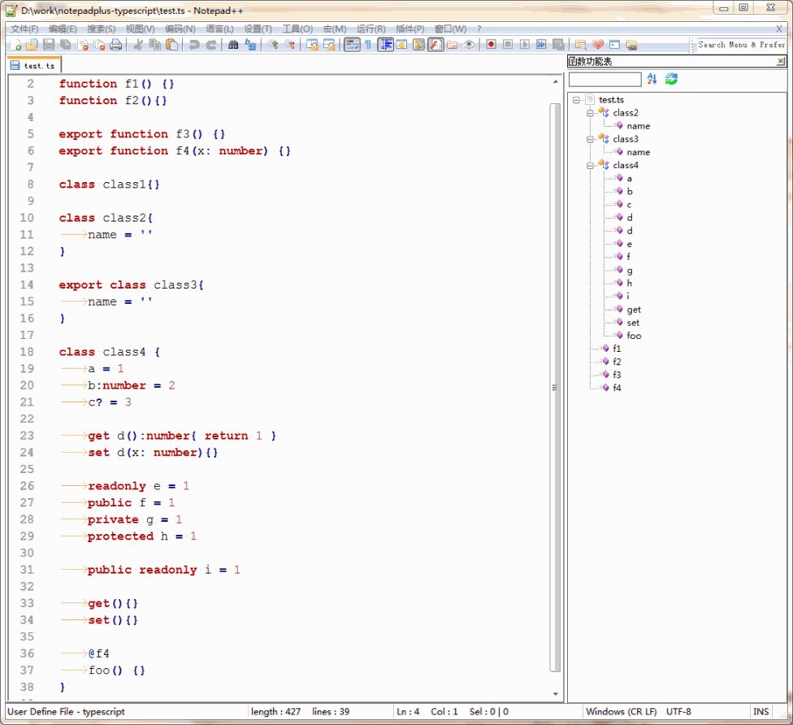

# notepad++ support TypeScript (Windows).

- http://www.typescriptlang.org/
- https://github.com/Microsoft/TypeScript/wiki/TypeScript-Editor-Support

## Notepad++ syntax highlighting

The `userDefineLang.xml` uses the new User Defined Language system (`UDL2`),
which needs `Notepad++ v6.2` or higher.

Installing from Notepad++ Installer

  1. Add the contents of `userDefineLang.xml` at `%APPDATA%\Notepad++\userDefineLang.xml`
     between `<NotepadPlus> ... </NotepadPlus>`
  2. Restart Notepad++

Installing from Notepad++ zip/7z package

  1. Given a Notepad++ installation at `<DIR>`.
  2. Add the contents of `userDefineLang.xml` at `<DIR>\userDefineLang.xml`
     between `<NotepadPlus> ... </NotepadPlus>`
  3. Restart Notepad++

**Reference:**

  1. http://sourceforge.net/apps/mediawiki/notepad-plus/index.php?title=User_Defined_Languages
  2. http://notepad-plus-plus.org/news/notepad-6.2-release-udl2.html
  3. http://udl20.weebly.com/index.html

## Notepad++ Function List

The `functionList.xml` uses the Function List Pane new feature,
which needs Notepad++ v6.4 or higher.

Installing from Notepad++ Installer

  1. Add the contents of `functionList.xml` at `%APPDATA%\Notepad++\functionList.xml`
     between `<associationMap> ... </associationMap>` and `<parsers> ... </parsers>`
  2. Restart Notepad++

Installing from Notepad++ zip/7z package

  1. Given a Notepad++ installation at `<DIR>`.
  2. Add the contents of `functionList.xml` at `<DIR>\functionList.xml`
     between `<associationMap> ... </associationMap>` and `<parsers> ... </parsers>`
  3. Restart Notepad++

**Reference:**

  1. http://notepad-plus-plus.org/features/function-list.html

## Screenshots

[simple.ts](simple.ts)

[test.ts](test.ts)

## BUGS

Please report bugs to <chaishushan@gmail.com>.

Thanks!
